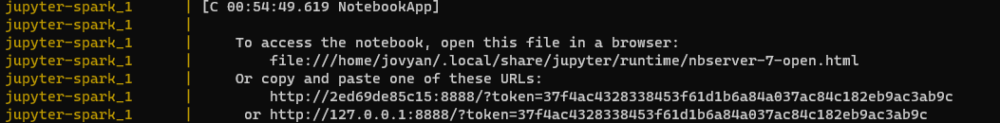
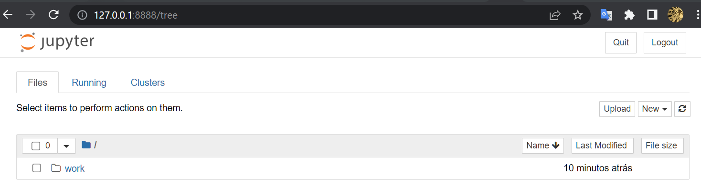

# Instalação do ambiente

## Infraestrutura

### 1. Clonar o projeto:

    $ git clone https://github.com/oscarokayama/engenharia-dados
  
### 2. Navegar até a pasta:

    $ cd '.\engenharia-dados\07. Docker\airflow-spark\docker\docker-airflow\'
  
### 3. Fazer build do projeto:

    $ docker build --rm --force-rm -t docker-airflow-spark:1.10.7_3.1.2 .

### 4. Voltar ao diretório onde está o arquivo "docker-compose.yml":

    $ cd ..

### 5. Rodar o docker-compose:

    $ docker-compose up

    * Obs: pode acontecer do postgres não subir, abortar a execução CTRL + C e rodar novamente o docker-compose:

    $ docker-compose up
    
### 6. Assim que rodar o projeto, abrir novo terminal e executar o seguinte comando para criar a base de dados:

    $ docker exec -it docker_postgres_1 /bin/bash -c "/docker-entrypoint-initdb.d/exec/init.sh"

## Scripts

Procurar nos logs de execução a seguinte linha "http://127.0.0.1:8888/?token=": 

Copiar a URL e abra no navegador

No Jupyter, entrar na pasta work:

Pastas:

  * csv
  
    ** Pasta onde ficam os arquivos csv de origem
    
  * export
  
    ** Pasta onde é gerado os arquivos flat
    
  * notebooks
  
    ** Pasta onde ficam os scripts de carga/teste/geração de arquivos
    
