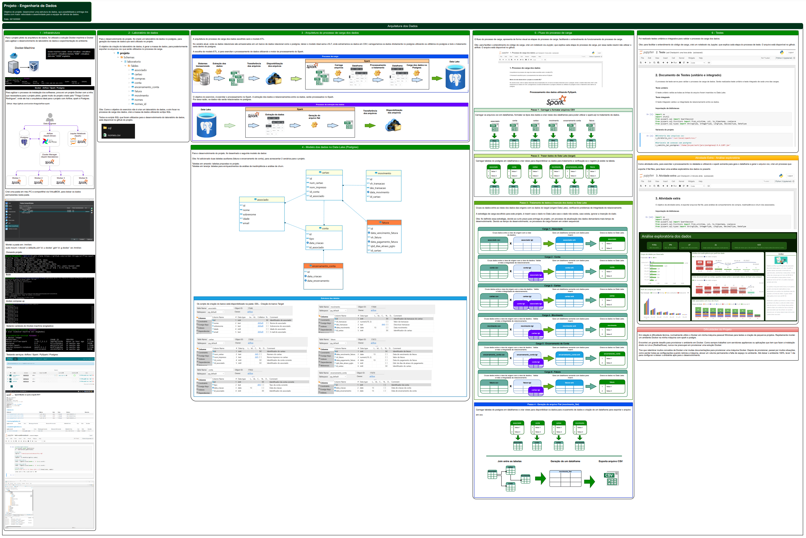
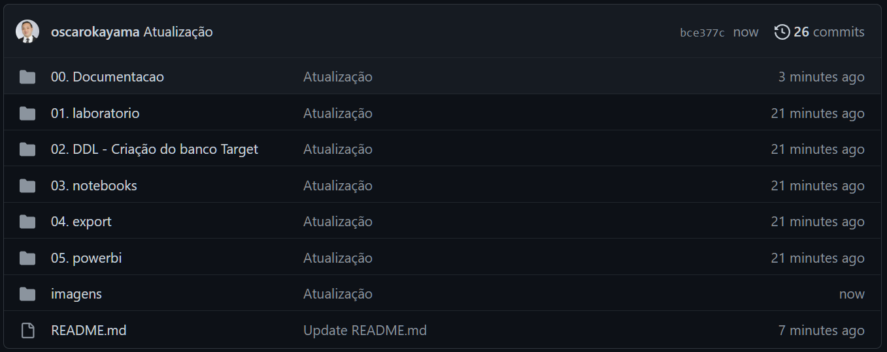
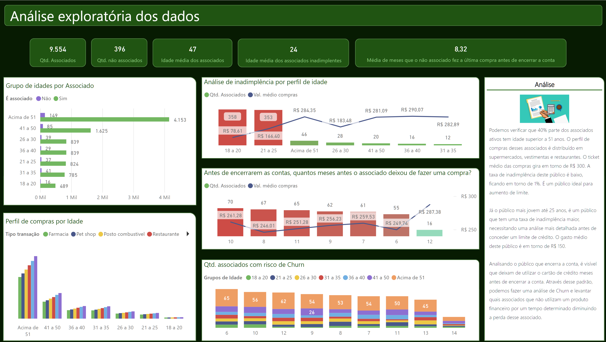

# Engenharia Dados Fácil - Docker (Utilizando Spark, Postgres e Airflow)
Projeto - Engenharia de Dados

  Objetivo do projeto: mostrar de forma simples, um projeto de engenharia de dados, que pode ser feito em qualquer lugar utilizando Docker. Um projeto simples que traz a arquitetura do ambiente, a estrutura de dados e a disponibilização dos dados com maior velocidade e assertividade para a equipe de ciência de dados.
  
  Data: 22/12/2022

## Resumo do projeto

Para facilitar o entendimento do projeto, criei um guia que auxilia o entendimento do projeto.

O guia está disponível em:

https://github.com/oscarokayama/engenharia-dados/blob/main/00.%20Documentacao/0.%20Projeto%20-%20Engenharia%20Dados.drawio.pdf

## Estrutura de pastas

* 00 . Documentacao (Pasta com a documentação do projeto e arquivos exportados em PDF)
  
  * 0 . Projeto - Engenharia Dados.drawio.pdf (Guia do projeto)
  * 1 . Processo de carga dos dados.pdf (Notebook do processo de carga)
  * 2 . Testes (unitário e integrado).pdf (Notebook com os testes unitários e integrado)
  * 3 . Atividade extra.pdf (Notebook com o export de arquivos csv que será utilizado no powerbi)
  * 4 . Extração de Dados - Usuário.ipynb (Notebook com o export do arquivo flat solicitado pelo usuário)

* 01 . laboratorio (Pasta com os scripts e arquivos utilizados para o desenvolvimento de um laboratório de dados para geração da massa de dados utilizados no projeto)
  
  * sql (Pasta com scripts DDL (criar tabelas, index, sequences) e DML (inserts e selects) para criação de tabelas e massas de dados para serem  utilizados no projeto
  * nomes.csv (Arquivo csv com nomes gerados aleatoriamente)

* 02 . DDL - Criação do banco Target (Pasta com os scripts SQL para criação de tabelas do banco de target)

  * ddl_target.sql (Script de criação de tabelas do banco de target)

* 03 . notebooks (Pasta com os arquivos Notebooks no formato "ipynb")

  * 1 . Processo de carga dos dados.ipynb (Notebook com o processo de carga documentado)
  * 2 . Teste.ipynb (Notebook com o processo de testes documentado)
  * 3 . Atividade extra.ipynb (Notebook com um script para extração de dados para serem utilizados no powerbi)

* 04 . export (Pasta com os arquivos flat gerados em CSV)

  * movimento_flat_csv.zip (Arquivo solicitado no projeto)
  * associado_comportamento_compras.csv (Arquivo extra utilizado no powerbi)
  * associado_compras_fatura_inad.csv (Arquivo extra utilizado no powerbi)

* 05 . powerbi (Pasta com um arquivo do powerbi de análise exploratória dos dados)

  * Analise dos associados.pbix (Arquivo powerbi com a análise exploratória)

## Sobre o projeto

* 1. O projeto foi desenvolvido utilizando Docker para montar o ambiente de desenvolvimento.
* 2. A arquitetura de soluções utilizadas foi (Spark + Postgres + Jupyter).
* 3. Para facilitar o entendimento do código, acabei utilizando o Jupyter Notebook para desenvolver os processos de carga, testes e extração de dados.
* 4. Como desenvolvi o projeto em Jupyter, acabei não utilizando o airflow.
* 5. Utilizei o software DBeaver para executar comandos SQL no Postgres.

### Docker

O projeto foi desenvolvido utilizando Docker-machine para provisionar o ambiente (virtualbox).
Para a arquitetura de desenvolvimento, gostei muito do projeto do Tiago Cordon e resolvi utilizar a arquitetura que ele apresentou:

Github: **https://github.com/cordon-thiago/airflow-spark**

### Jupyter

Para desenvolvimento do projeto, preferi utilizar o Jupyter ao invés de Airflow, para facilitar a explicação do código utilizado para o projeto.

### Processo de carga

Como o objetivo do projeto, seria desenvolver um processo de ETL utilizando uma solução de bigdata, escolhi a linguagem Spark/PySpark para o desenvolvimento.

Todo o desenvolvimento, foi desenvolvido para o processamento dos dados ocorrer no Spark e não no banco de dados Postgres.

### Postgres

Para o repositório de dados do Data Lake, resolvi utilizar o Postgres

### Ambiente de laboratório

Criei um ambiente de laboratório para desenvolver uma estrutura inicial dos dados no postgres e também gerar a massa de dados que foi utilizado no projeto.

### Powerbi

Para avaliar a qualidade dos dados gerados no laboratório, resolvi criar um Dash no PowerBI para trazer alguns visões e análises.

## Dificuldades do Projeto

Normalmente utilizo o Docker em minha máquina pessoal Windows para testes e criação de pequenos projetos. Rapidamente montei um ambiente Docker na minha máquina com spark e postgre.

Encontrei um grande desafio para provisionar o ambiente em Docker. Como sempre trabalhei com servidores appliances ou aplicações que tem que fazer a instalação direto no Linux (Redhat/Suse), nunca me preocupei em provisionar uma solução Docker.

Tive que relembrar muitos conceitos de Docker e ler muitas documentações para provisionar uma máquina Docker. Depois de provisionar, passei por muitos situações, como perder todas as configurações quando reinicia a máquina, alocar um volume permanente e falta de espaço no ambiente. Até deixar o ambiente 100%, levei 1 dia para configurar e deixar o ambiente apto para o desenvolvimento.

## Mais informações

Para um detalhamento melhor do projeto, favor entrar em contato através do e-mail: oscar.okayama@hotmail.com

